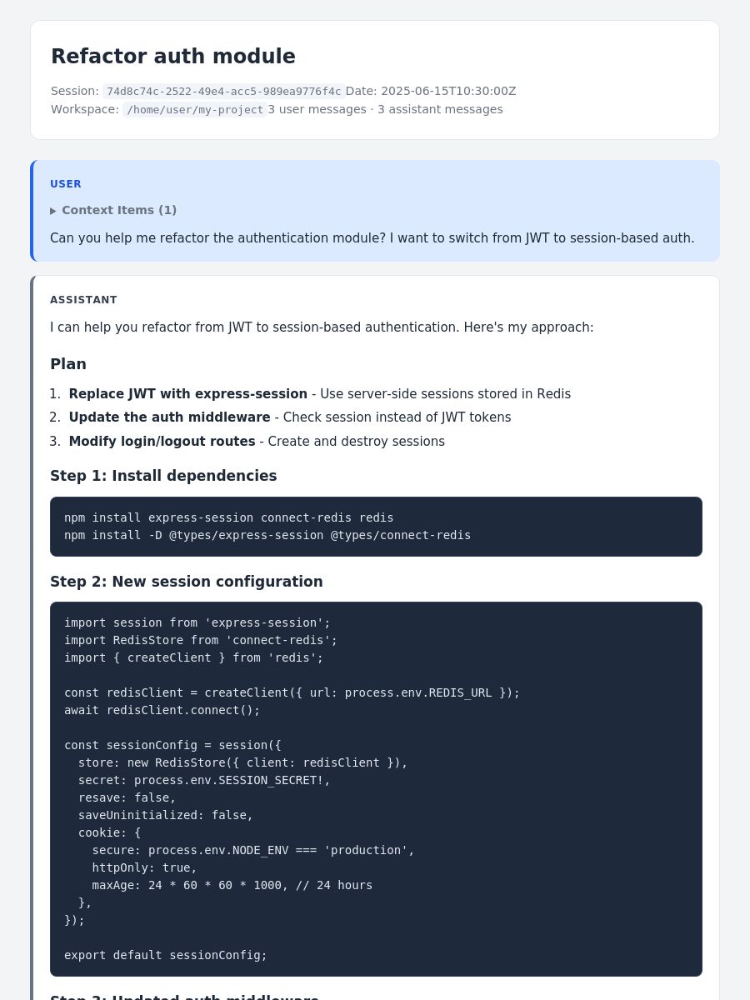

# continue-transcripts

Convert [continue.dev](https://continue.dev) session files to readable, self-contained HTML transcripts.



## Features

- Converts continue.dev session JSON files into styled, self-contained HTML pages
- Renders assistant messages as Markdown (code blocks, tables, task lists, etc.) with syntax highlighting
- **ANSI → HTML** — terminal output with color codes is rendered as styled HTML (One Dark palette)
- **Human-readable tool calls** — `$ command` for Bash, `key: value` for file paths, structured display for multi-arg tools (no raw JSON dumps)
- **Tool calls nested under assistant messages** — tool calls and their results appear indented under the assistant message that invoked them
- **Collapsible thinking & tool results** — thinking blocks and tool results start collapsed; expand on click
- **System prompt at top** — the first system message is extracted and displayed in a collapsible section above the transcript
- **Detailed tools reference panel** — all tools used in the session are listed with full descriptions, parameters, and usage notes (parsed from the system prompt), each in its own collapsible section
- **Token usage tracking** — per-message token counts (prompt + completion) with running cumulative totals and session-wide summary in the header (when usage data is available in the session)
- Displays context items (attached files/code) in collapsible sections
- Generates an `index.html` linking all processed sessions when given a directory
- Optional title-based filtering with `--filter`
- **Parallel processing** with configurable worker count (`--workers`)
- **Terminal summary** — file counts, elapsed time, and per-file status indicators
- **Date+time-prefixed filenames** — output files are named `YYYY-MM-DD_HHMM_Title.html` for easy chronological sorting (falls back to `YYYY-MM-DD_Title.html` when time is unavailable)
- **Filename deduplication** — output filenames are truncated to 60 characters with automatic `_1`, `_2` suffixes on collision
- Responsive design — works on desktop and mobile

## Quick start

```sh
# Build from source (requires Rust toolchain)
cargo build --release

# Convert a single session file
./target/release/continue-transcripts session.json

# Convert all sessions in a directory
./target/release/continue-transcripts ~/.continue/sessions/ -o ./transcripts

# Filter by title and date, and use 4 workers
./target/release/continue-transcripts ~/.continue/sessions/ --filter "auth" --since 2025-01-01 -w 4 -o ./transcripts
```

Output looks like:

```
Using 4 worker thread(s)
Discovered 12 JSON file(s)
  ✅ transcripts/2025-06-15_1430_Fix_failing_tests_in_auth_module.html
  ✅ transcripts/2025-06-14_0915_Refactor_auth_module.html
  ...
  ✅ transcripts/index.html

═══════════════════════════════════════════
  Summary
═══════════════════════════════════════════
  Files discovered:  12
  Sessions written:  10 (+ 1 index)
  Skipped:           2
  Workers:           4
  Elapsed:           1.23s
───────────────────────────────────────────
  ✅ All files processed successfully!
```

## Installation

Pre-built wheels are available from [GitHub Releases](https://github.com/curtisalexander/continue-transcripts/releases). No Rust toolchain is required — just Python >= 3.9 and `uv`.

### With `uv tool install` (recommended)

Install globally so the `continue-transcripts` command is always available:

```sh
uv tool install continue-transcripts \
  --no-index \
  --find-links https://github.com/curtisalexander/continue-transcripts/releases/expanded_assets/v0.16.1
```

The `continue-transcripts` command is then available on your `PATH`.

To upgrade later (update the version in the URL):

```sh
uv tool install --upgrade continue-transcripts \
  --no-index \
  --find-links https://github.com/curtisalexander/continue-transcripts/releases/expanded_assets/v0.16.1
```

To uninstall:

```sh
uv tool uninstall continue-transcripts
```

### With `uvx` (one-off runs)

Run without installing:

```sh
uvx \
  --no-index \
  --from continue-transcripts \
  --find-links https://github.com/curtisalexander/continue-transcripts/releases/expanded_assets/v0.16.1 \
  continue-transcripts ./sessions
```

This is useful for a quick one-off conversion without permanently installing the tool.

### With `uv pip install`

Install into a specific virtual environment:

```sh
uv venv .venv
source .venv/bin/activate
uv pip install continue-transcripts \
  --no-index \
  --find-links https://github.com/curtisalexander/continue-transcripts/releases/expanded_assets/v0.16.1
```

### Building from source

If you prefer to build from source (or need a platform not covered by the pre-built wheels), you can install directly from the Git repository. This requires a [Rust toolchain](https://rustup.rs/) in addition to Python >= 3.9:

```sh
uv tool install git+https://github.com/curtisalexander/continue-transcripts
```

Or build with Cargo directly:

```sh
cargo build --release
```

### Pre-built wheel platforms

Wheels are built in CI for the following targets:

| Platform | Target |
|----------|--------|
| Linux x86_64 | `x86_64-unknown-linux-gnu` |
| Linux aarch64 | `aarch64-unknown-linux-gnu` |
| macOS Apple Silicon | `aarch64-apple-darwin` |
| Windows x86_64 | `x86_64-pc-windows-msvc` |

## Usage

```
continue-transcripts [OPTIONS] <INPUT>
```

### Arguments

| Argument | Description |
|----------|-------------|
| `INPUT` | Path to a single session JSON file or a directory containing session files |

### Options

| Option | Description |
|--------|-------------|
| `-o`, `--output <DIR>` | Output directory for generated HTML (default: `output`) |
| `--filter <STRING>` | Only process sessions whose title contains this string (case-insensitive) |
| `--since <YYYY-MM-DD>` | Only include sessions created on or after this date |
| `--before <YYYY-MM-DD>` | Only include sessions created before this date |
| `-w`, `--workers <N>` | Number of parallel worker threads (defaults to number of CPU cores) |
| `-h`, `--help` | Print help |

### Examples

Convert a single session file:

```sh
continue-transcripts session.json
```

Convert all sessions in a directory:

```sh
continue-transcripts ~/.continue/sessions/ -o ./transcripts
```

Filter sessions by title:

```sh
continue-transcripts ~/.continue/sessions/ --filter "auth" -o ./transcripts
```

Filter sessions by creation date:

```sh
# Include sessions from Jan 1, 2025 onward
continue-transcripts ~/.continue/sessions/ --since 2025-01-01 -o ./transcripts

# Include sessions before Apr 1, 2025 (exclusive)
continue-transcripts ~/.continue/sessions/ --before 2025-04-01 -o ./transcripts

# Combine filters
continue-transcripts ~/.continue/sessions/ --since 2025-01-01 --before 2025-04-01 --filter "auth"
```

Use 8 worker threads for a large directory:

```sh
continue-transcripts ~/.continue/sessions/ -w 8 -o ./transcripts
```

The tool writes one HTML file per session to the output directory, plus an `index.html` that links to each transcript.

## Where are continue.dev sessions stored?

Continue stores data in `~/.continue/` on Linux and macOS (`%USERPROFILE%\.continue\` on Windows). Session history files are JSON files within this directory. The exact subdirectory may vary by version — check your `~/.continue/` tree or use `find ~/.continue -name '*.json'` to locate them.

The converter skips `sessions.json` automatically. When processing a directory, it uses that metadata file as a fallback source for creation dates when individual session JSON files do not contain `dateCreated`.

## Privacy and sharing

Generated transcripts are self-contained HTML files intended for local viewing or sharing. They may include prompts, tool output, attached context, file paths, terminal output, and snippets of source code from your Continue sessions. Review transcripts before sharing them publicly.

For safer sharing, session Markdown is rendered with raw HTML escaped rather than executed, and generated pages do not load external CSS, JavaScript, fonts, or images.

## Troubleshooting

- **No files found**: verify the input path and locate session JSON files with `find ~/.continue -name '*.json'`.
- **No sessions after filtering**: `--before` is exclusive and both date flags expect `YYYY-MM-DD`.
- **Command not found after install**: ensure your `uv`/Python tool bin directory is on `PATH`, or run with `uvx`.
- **Unsupported platform wheel**: install from source with a Rust toolchain using `uv tool install git+https://github.com/curtisalexander/continue-transcripts` or `cargo build --release`.

## How it works

1. Discovers session JSON files from the input path (single file or recursive directory scan)
2. Reads and parses files in parallel using [rayon](https://crates.io/crates/rayon) (configurable thread count)
3. For each session:
   - Extracts the system prompt (first `system` message) to a collapsible top section
   - Collects full tool descriptions from the system prompt and renders each tool as a collapsible reference panel with parameters and usage details
   - Tracks token usage per message and calculates running cumulative totals
   - Groups assistant messages with their tool calls and tool results
   - Converts ANSI escape codes in tool output to styled HTML
   - Renders Markdown to HTML with syntax highlighting via [pulldown-cmark](https://crates.io/crates/pulldown-cmark) + [syntect](https://crates.io/crates/syntect)
4. Produces a self-contained HTML file per session (all CSS and JavaScript are embedded — no external dependencies)
5. Deduplicates output filenames (truncated to 60 chars, with `_1`, `_2` suffixes on collision)
6. Generates an `index.html` listing all sessions when processing multiple files
7. Prints a summary with file counts, timing, and status indicators

## Inspiration

Inspired by Simon Willison's [claude-code-transcripts](https://github.com/simonw/claude-code-transcripts).

## License

MIT
